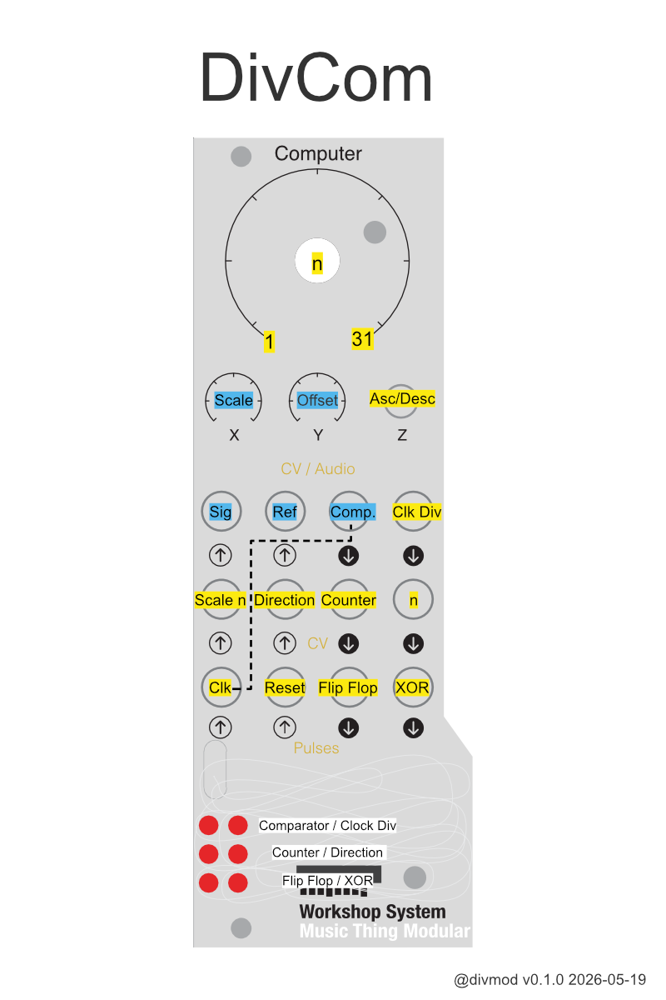

DivCom
=======

Comparator and voltage-controlled clock divider for the Modular Music Thing Computer. Inspired by Serge NCOM.

DivCom is split into two  sections:

* the **comparator** (blue) compares a signal against a reference and outputs high if signal > reference
* the **clock divider** (yellow) counts clock pulses, and outputs a gate every `n` clocks.

The two sections can be used together or separately. By default, the clock divider is normalled to the comparator, so comparator rising edges advance the divider. Patching a clock into `Pulse In 1` breaks that normalisation and lets the divider run from an external clock instead.




## Comparator

The comparator tests: `Sig > Offset + Scale * Ref`

`Audio In 1` is the signal input.

`Audio In 2` is the reference input.

`Audio Out 1` is the comparator gate. It is high when the signal is above the scaled and offset reference, and low otherwise. A small hysteresis keeps the output stable. 

Knob `X` controls the reference scale.

Knob `Y` controls the offset.

If both audio inputs are unpatched, DivCom uses an internal random sample-and-hold signal as the comparator input. The sample-and-hold rate is controlled by `X`, from 1 Hz to 12 kHz.

## Clock divider

The main knob selects the divider value `n`, from 1 to 31.

`CV In 1` scales the selected `n`: 0V gives `n = 1`, 5V gives the selected value.

`Pulse In 1` is the clock input for the divider. It increments the counter on rising edges. If nothing is patched, it is normalled to the comparator, so the counter advances on comparator rising edges.

`Pulse In 2` resets the divider.

`Audio Out 2` is the clock divider gate. It goes high when the counter reaches `n`, or after reset. It goes low again on the next clock or comparator change.

`Pulse Out 1` is a flip-flop. It toggles on each divider reset: high for one divider cycle, low for the next.

`Pulse Out 2` is XOR. It is high when the comparator and clock divider states differ. In normal use this gives the comparator gate with the clock divider pulse removed.

## Counter CV outputs

`CV Out 1` is the current clock divider counter value as whole-tone steps in V/oct.

The switch  changes the pitch mapping of the counter CV: up for ascending steps, middle for descending steps. `CV In 2` inverts this direction. Note: This changes only the pitch, the counter itself always counts up.

`CV Out 2` is the current `n` value as whole-tone steps in V/oct, after scaling the main knob by `CV In 1`.


Installation
------------

See dist/ for pre-compiled .uf2 images.

Building
--------

You should be able to build this with CMake.

```
mdkir build
cd build
cmake ..
make
```

Thanks
------

Thanks to TomWhitwell for building the Workshop System and chrisgjohnson for ComputerCard.
