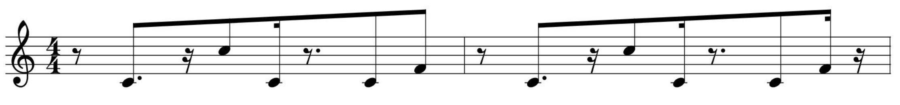
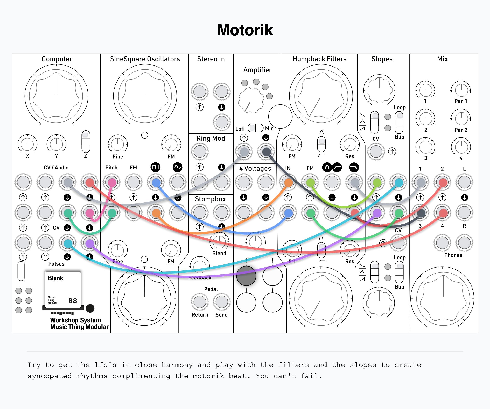

# Motorik music machine

A generative drum and bassline machine for the  [Music Thing Modular Workshop Computer](https://www.musicthing.co.uk/Workshop-Computer/), inspired by the hypnotic "motorik" beats of Krautrock pioneers like Neu!, Kraftwerk and Can.

## The groove that never stops

In the early 1970s, in a Hamburg studio with producer Conny Plank, two former Kraftwerk members — drummer Klaus Dinger and guitarist Michael Rother — laid down a rhythm nobody had heard before. Dinger called it the **"Apache beat"**. Music journalists later christened it **motorik** — German for "motor skill," evoking the forward momentum of driving on the autobahn.

Dinger played it as a simple, perpetual 4/4 pulse with only occasional interruptions: a kick drum-heavy, pulsating groove that never stopped, never broke, never let up. "It's essentially about life," he said, "how you have to keep moving, get on and stay in motion." His counterpart in Can, Jaki Liebezeit, arrived at the same pulse independently — a rhythm stripped of swing, of flourish, of ego. Just forward motion. Their self-titled debut album *Neu!* (1972) sold 30,000 copies. Its opening track, "Hallogallo," is motorik in its purest form.

Kraftwerk channeled the same pulse into "Autobahn," a 22-minute journey that carried the motorik beat from the Düsseldorf underground onto international charts. Together, Can's hypnotic repetition, Neu!'s perpetual groove, and Kraftwerk's machine-soul fusion built the foundation on which modern electronic music stands.

The influence radiates outward through decades. David Bowie and Brian Eno listened obsessively to Neu! in the mid-70s; you can hear it in *Low* and *"Heroes".* Iggy Pop, John Lydon (Sex Pistols / PiL), Siouxsie and the Banshees, Joy Division, and Sonic Youth all drew from the same well. In the 90s, Stereolab, Tortoise, and Radiohead picked up the pulse. In the 2000s, LCD Soundsystem, The War on Drugs, and King Gizzard & the Lizard Wizard kept it rolling. Without Dinger and Rother in that Hamburg studio in 1971, there is no post-punk, no krautrock revival, no hypnotic repetition in indie and electronic music as we know it.

**This card is an invitation to step inside the pulse.** The Apache beat — kick on 1, &, 3-e, &, a-of-4; snare on 2 and 4; hihat on every 8th — is set in stone. You don't sequence it. You don't program it. You *inhabit* it. Everything else — energy density, spectral tilt, pattern mutation, resonant filter wash, sample-rate decimation, bass line shifts — is yours to sculpt. The constraint **is** the freedom. Turn the knobs, patch the cables, and the groove breathes with you.

## Features

- **3-voice TR-808 samples**: Real 808 kick, snare, and closed hihat at 48kHz
- **Apache/Motorik rhythm**: Classic breakbeat pattern with dramatic hihat breaks and 4-on-the-floor fills
- **Driving bass line**: CV/gate output following the Neu bass line phrasing — short rests, octave jumps, and a brief gate-off retrigger dip on each note for clean articulation
- **Bass mirror at +1 octave**: CV Out 2 / Pulse Out 2 mirrors the bass pattern one octave up for filter modulation or a second voice
- **Pattern energy control**: Progressive layer mix (kick-only → full pattern → double-time hihats)
- **Spectral tilt**: Crossfade between kick-heavy and hihat-heavy drum balance
- **Pattern variation**: Ephemeral per-bar mutation — the pattern breathes without drifting
- **Bass pattern shift**: Offset bass timing to create polyrhythmic tension between root and +12 mirror
- **Resonant texture filter**: One-pole low-pass with natural feedback — from dry and bright to dark and washed out
- **Humanized timing**: Per-voice micro-delay via xorshift32 RNG (0–15 samples)
- **Internal clock** at 120 BPM, or external clock via Pulse In 1
- **6-segment LED bar**: Beat position, bass activity, and fill indicator

## Controls

The Z switch defines the performance mode.
Each mode gives the three knobs a distinct function.

### Z = Up — Texture/Wash, Decimation, Variation & Humanize

| Knob | Function |
|------|----------|
| **Main** | Texture / wash when Audio In 2 is disconnected — resonant low-pass filter depth. Left = bright and dry, right = dark and washed out. When Audio In 2 is patched, the Main knob instead controls decimation (sample rate reduction): left = clean 48kHz, right = gritty crushed output down to ~200Hz. Filter control moves to Audio In 2. |
| **X** | Pattern variation — 0 = locked (exact repeat), full = ~6% chance per step per voice to toggle bits each bar. Mutations are ephemeral: the base pattern is restored at the start of each bar, so the groove breathes without drifting. |
| **Y** | Humanize range: 0 = tight quantization, full = ±15 sample swing per trigger |

### Z = Middle — Drum Mode (default)

| Knob | Function |
|------|----------|
| **Main** | Pattern energy — progressive layer mix in 4 zones. Left = kick only, right = full pattern with double-time hihats. |
| **X** | Root transpose (0–12 semitones) for bass (MIDI 36) and CV Out 2 (MIDI 48) |
| **Y** | Fill probability: 0 = never, full = ~50% chance per bar |

### Z = Down — Tilt & Bass Shift

| Knob | Function |
|------|----------|
| **Main** | Spectral tilt — crossfades between kick-heavy (left) and hihat-heavy (right). Snare stays constant. Full left = deep kick pulse, center = balanced, full right = washy hihat drive. |
| **X** | Bass root pattern shift (-4 to +4 steps). Shifts bar 1 timing forward or backward. At center the pattern plays normally. Offset creates rhythmic tension between the bass and drums. |
| **Y** | Bass mirror pattern shift (-4 to +4 steps). Same as X but shifts bar 2 (the +12 mirror). Shifting bar 1 and bar 2 independently creates off-grid tension between the two CV outputs. |

All values persist when switching modes.

## Inputs & Outputs

| Jack | Direction | Function |
|------|-----------|----------|
| **Pulse In 1** | Input | External clock (rising edge). Disconnected → internal 120 BPM clock. |
| **Pulse In 2** | Input | Fill trigger (rising edge). Each pulse triggers a one-bar fill. Works alongside probabilistic fills from the Y knob. |
| **Audio In 1** | Input | Energy zone override (envelope follower). External audio or CV dynamically layers voices — quiet/thin input = kick only, loud/dense input = full pattern with double-time hihats. When nothing patched, the Main knob in Z=Middle controls energy. |
| **Audio In 2** | Input | Texture filter override (envelope follower). External audio or CV drives the resonant low-pass wash — quiet/bright patches open up the mix, loud/dark signals drown it in dub texture. When nothing's patched, the Z=Up Main knob controls the filter. |
| **CV In 1** | Input | Bass root transpose CV. Adds to the X knob root offset, ±12 semitones range. Sequence chord changes from an external step sequencer. Clamped to MIDI 24–60. |
| **CV In 2** | Input | Bass pattern shift modulation. Adds to the X/Y knob shift values, ±4 steps range. Slow LFOs or random CV create woozy, off-grid bass timing. |
| **Pulse Out 1** | Output | Bass gate (high during notes, low during rests and retrigger dip) |
| **Pulse Out 2** | Output | Bass mirror gate (same pattern, one octave up) |
| **CV Out 1** | Output | Bass pitch CV (MIDI note scale, 0V during rests) |
| **CV Out 2** | Output | Bass mirror pitch CV (root + 12 semitones, 0V during rests) |
| **Audio Out 1** | Output | Drum mix with spectral tilt, optionally filtered when Z = Up |
| **Audio Out 2** | Output | Same drum mix |

## LEDs

| LED | Function |
|-----|----------|
| 0–3 | Quarter-note beat position (0 = downbeat) |
| 4 | Bass note active |
| 5 | Fill active |

## Rhythm Engine

The base pattern is the classic Apache breakbeat in a 16-step grid:

```
Step:  0  1  2  3  4  5  6  7  8  9 10 11 12 13 14 15
Kick:  X  .  X  .  .  .  X  .  X  .  X  .  .  .  X  .
Snare: .  .  .  .  X  .  .  .  .  .  .  .  X  .  .  .
HiHat: X  .  X  .  X  .  X  .  X  .  X  .  X  .  X  .
```

Kick on 1, &, 3-e, &, a-of-4. Snare on 2 and 4. Hihat every 8th note.

### Pattern Energy (Main knob, Z = Middle)

The big knob progressively unmutes voices and adds density:

| Main knob | Zone | Playing |
|-----------|------|---------|
| 0–25% | 0 | Kick only |
| 25–50% | 1 | Kick + hihat (8th notes) |
| 50–75% | 2 | Full pattern (kick + snare + hihat) — default |
| 75–100% | 3 | Full pattern + hihat double-time (16th notes) |

Fills function in all zones — the energy zone is the floor, fills add extra snare hits on top.

### Pattern Variation (X knob, Z = Up)

At the start of each bar, when variation is active, every step in every voice pattern has a chance of being toggled (added or removed). The probability per step scales from 0% (full left) to ~6% (full right). Mutations are ephemeral — the base pattern is restored at the start of the next bar, so the groove never permanently drifts. The result is a breathing, evolving rhythm that stays recognizable.

### Spectral Tilt (Main knob, Z = Down)

Crossfades between kick-heavy and hihat-heavy drum balance. Snare stays at constant level throughout.

| Tilt position | Kick level | Hihat level | Sound |
|---------------|-----------|-------------|-------|
| Full left | 100% | 30% | Deep kick pulse, minimal hihat |
| Center | 65% | 65% | Balanced |
| Full right | 30% | 100% | Washy hihat drive, kick recedes |

### Bass Pattern Shift (X/Y knobs, Z = Down)

Shifts the bass event pattern forward or backward in time, creating rhythmic tension. Center position = normal timing. Full left = 4 steps earlier, full right = 4 steps later.

Bar 1 (bass root, X knob) and bar 2 (bass mirror, Y knob) shift independently. When they diverge, the root and its +12 octave play at different points in the pattern — rhythmic tension that resolves when you return to center.

### Fills

Fills disrupt the pattern for one bar, then restore it. Two types, chosen at random:

| Fill type | What happens |
|-----------|-------------|
| Hihat break | Hihat stripped to one hit on step 0 (sudden drop), kick and snare play normal. The groove thins out — returns feel powerful. |
| 4-on-the-floor | Kick and snare hit every quarter note (steps 0, 4, 8, 12), hihat stays. Everyone lands together — a driving push. |

Fill probability is set by the Y knob when Z = Middle: at 0 no fills occur, at max a fill triggers roughly every other bar. Fills restore the original pattern after one bar.

### Humanize / Swing (Y knob, Z = Up)

Per-trigger random micro-delay (0–15 audio samples, or 0–312µs) applied independently to each voice. At Y = 0 all hits are quantized; at Y = max each voice drifts by up to 15 samples. The default (when Z is not Up) is 0–3 samples.

### Texture / Wash (Main knob, Z = Up)

A one-pole resonant low-pass filter applied to the drum mix every sample.
Knob left = bright, dry signal.
Knob right = dark, resonant wash with natural feedback.
Filter state is continuous — slow knob sweeps create evolving dub/kosmische textures.

## Bass Sequence

A driving 2-bar bass line in minor pentatonic with short rests and an octave jump, following the Neu bass phrasing:



Each note has a brief gate-off dip (~4ms) at the onset so the receiving synth re-articulates cleanly. Root = MIDI 36 + X knob when Z is Up or Middle; when Z is Down, the last-set transpose value is held. The two bars alternate — Bar 2 shortens the 4th and adds a trailing rest for subtle motion.

CV Out 2 mirrors the bass at root + 12 semitones with the same rhythm, rests, and gate pattern. Use it to modulate a filter, drive a second oscillator, or patch anywhere the groove needs to reach.

## Technical Notes

- **Sample rate**: 48kHz (fixed, hardware-defined)
- **Samples**: TR-808 kick (250ms), snare (250ms), hihat (125ms) — sourced from Compulidian, resampled 44.1→48kHz, scaled to ±2047
- **Internal BPM**: 120 (fixed). Use Pulse In 1 for external clock at any tempo.
- **Pattern engine**: 16-bit bitmasks per voice, mutated via XOR for variation, OR for fills
- **Spectral tilt**: per-voice level scaling — kick: 1229–4096, snare: 2048 (constant), hihat: 4096–1229, mixed via ×4096/>>12
- **Humanize**: xorshift32 RNG, independent per voice
- **Texture filter**: one-pole IIR low-pass, coefficient 8–255 (bright→dark), with gentle feedback resonance
- **CPU clock**: 144MHz (`set_sys_clock_khz`) to reduce ADC artefacts
- **Binary type**: `copy_to_ram` for jitter-free sample playback
- **Binary size**: ~154KB UF2

## Example Patch



## Build

Requires Pico SDK at `PICO_SDK_PATH`.

```bash
cmake -S . -B build
cmake --build build -j$(sysctl -n hw.logicalcpu)
# Output: build/motorik.uf2
```

Flash by holding BOOTSEL while connecting USB, then copy the `.uf2` to the mounted drive.

## Credits

- Conny Plank, Klaus Dinger and Michael Rother for giving the world the apache beat
- 808 drum samples from the Compulidian project
- Built with the Workshop Computer ComputerCard library by Chris Johnson
- Built by Joep Vermaat using opencode, using GLM 5.1, Deepseek 4 Pro

Many thanks to Tom Whitwell and the Music Thing Modular Community for making this highly addictive and inspiring musical platform and giving me the inspiration to make this.

## License

This project is released under the [MIT License](LICENSE). Use it, modify it, fork it, break it, improve it. No warranties, no liabilities. If you build something from this, you don't owe me anything — but I'd love to hear about it.

